# Rasgo Demonstration
## Demo Use Case
A large sporting good manufacturer is interested in forecasting monthly sales to help it manage its supply chain, marketing plans and pricing. The company has access to the following data:

- Store level data for:
    - Daily sales
    - Weekly advertising 
    - Weekly inventory and pricing
- Country-wide data for:
    - Weekly advertising campaigns
    - Weekly Google trends for sports terms

The company proposed two projects for the data science team.  First, the company would like a monthly sales forecast based on this data.  Second, the company would like to explore the impact of outside factors on monthly sales.

The data science team has assigned a senior data scientist to prepare all of the above data into a single pandas dataframe that they can then use to build the forecasting model.  In addition, the senior data scientist will share the final modeling data with the rest of the team to enable additional investigations.  Once this data is shared, the data science team assigns a junior data scientist to investigate the impact of weather on monthly sales.

This demo begins with the senior data scientist having completed the data preparation process and the resulting sales forecasting modeling dataset in a pandas dataframe.  The demo then shows how the senior data scientist can share the data in Rasgo and the junior data scientist can find this data, join weather data to it, prepare it for their use case and download the data into pandas for further modeling.

In this demo, working as the senior data scientist, you will see how you can:
1. Create an account on Rasgo.
2. Upload the completed dataframe from Python to Rasgo.
3. Publish that data so that others in your organization will be able to find the data.

In addition, as the junior data scientist, you will:
1. Log into the Rasgo web app.
2. Find the sales data.
    1. Explore the data
    2. Create an intial modeling dataset.
3. Find and join weather data.
4. Aggregate weekly data and perform feature engineering.
4. Extract the data from Rasgo to pandas for final analysis

## Demo

### 1. Install PyRasgo.
In order to publish data to Rasgo, you will need to install Rasgo's PyRasgo Python package.

    pip install pyrasgo

### 2. Create account on Rasgo.
Next, click [here](https://app.rasgoml.com/account/register) to create an account on the Rasgo UI. Fill in the required information on the web page.

  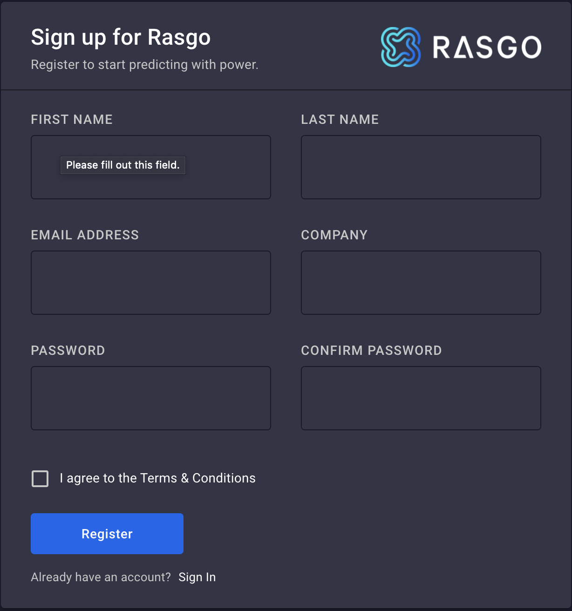

You can close the browser tab as you will receive an email from rasgo to verify your email address. Click the **Verify Email** button to verify.

  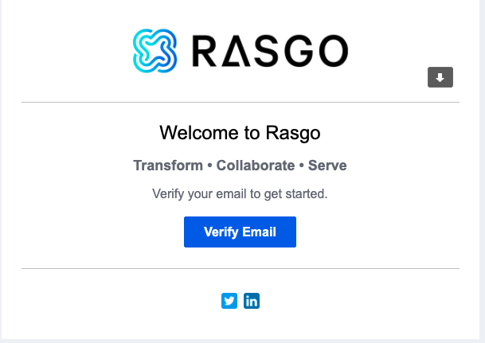

This will open browser tab where you can log into the UI.

### 3. Log into the Rasgo UI
Enter your username and password and click **Login**.

  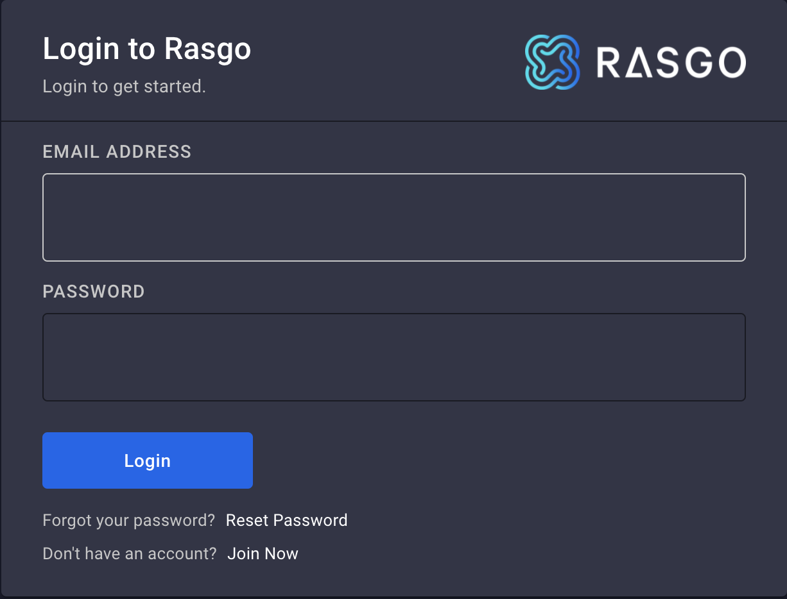

to be taken to the Rasgo App homepage.

### 4. Copy your API key
Click the **API KEY** button in the upper right of the screen

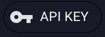

to copy your API key to the clipboard.

### 5. Connect to Rasgo from Python
Using the API Key, create a connection to Rasgo from Python.

    api_key = "<API Key from clipboard>"
    rasgo = pyrasgo.connect(api_key)
        
### 6. Copy the final modeling dataset into Python
The final modeling data can be found [here](https://raw.githubusercontent.com/rasgointelligence/Rasgo-demo/main/demokit/sports-sales-demo/data/finalmodel.csv). You can download it into a pandas dataframe by running

    url = "https://raw.githubusercontent.com/rasgointelligence/Rasgo-demo/main/demokit/sports-sales-demo/data/finalmodel.csv"
    modelingdf = pd.read_csv(url)
    
Convert the date representing the month (**MONTH**) into a datetime compatible with Rasgo to enable datetime related feature engineering and merging.

    modelingdf['MONTH'] = pd.to_datetime(modelingdf.MONTH).dt.date
    
### 7. Publish data to Rasgo
In order to share this data in Rasgo, it first needs to be uploaded to Rasgo as a source. This will store the data in a table on Snowflake.

    datasource = rasgo.publish.source_data(source_type="dataframe",
                                           df=modelingdf,
                                           data_source_name="Sales Demo Data",
                                           data_source_table_name="SALES_DEMO_DATA",
                                           if_exists="replace")
                                           
The key parameters are:
- *data_source_name*: Specify the name of the data source as it will appear on Rasgo.
- *data_source_table_name*: Specify the name of the Snowflake table this data will be stored in.
- *if_exists*: Control what happens when a source is published more than once.
    - "fail": Causes the program to fail.
    - "replace": Replaces the existing data with the data contained in the dataframe.
    - "append": Appends the data in the dataframe to the existing data in the Snowflake table.
                                           
Next, in order to make this data available for others to use within Rasgo, the data needs to be published as features.

    features = [i for i in modelingdf.columns if i not in ['MONTH', 'FIPS']]
    featureset = rasgo.publish.features_from_source(data_source_id=datasource.id,
                                                    dimensions=['MONTH', 'FIPS'],
                                                    granularity=['month', 'FIPS'],
                                                    features=features,
                                                    tags=['demo_sales', 'sales_sports'],
                                                    sandbox=False)

The key parameters are:
- *dimensions*: The columns in the original dataframe or source that can be used to join or merge data together.
- *granularity*: Certain types of columns may represent different levels within the data. For example, a date could represent an hour, a day, a week, a month, etc.
- *tags*: Rasgo allows you to set hashtags on features that can be used to find the features.
- *sandbox*: Rasgo allows you to specify if the features are ready for production (**False**), otherwise (**True**) they are marked as sandbox features.

At this point, the senior data scientist has published the results of their data preparation process. In the next few steps, a junior data scientist will find this data on the Rasgo UI, begin working with it and ultimately pull it back into their Python environment for further analysis.

### 8. Find sales data on Rasgo
When you first open [Rasgo](https://app.rasgoml.com), you are shown the homepage that details recent activity within your organization. You can search for and examine features by clicking the feature button in the upper left hand corner.

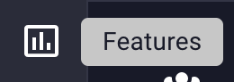

to take you to the **Explore Features** page.

You can explore by **Hashtags**, **Data Sources**, **Dimensions**, or **Data Types**. Most commonly you will explore by **Hashtags**

  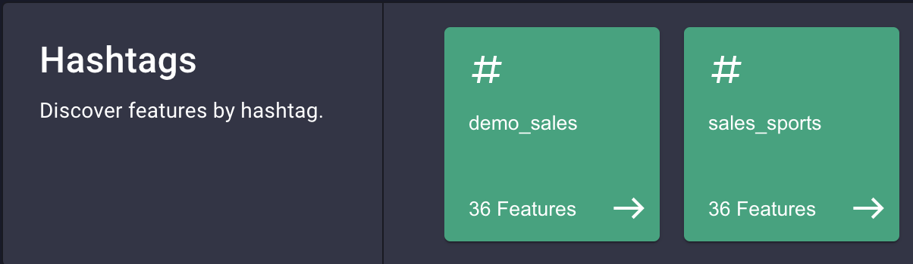

or **Data Sources**

  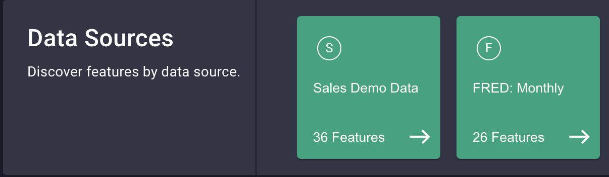

Next to **Hashtags**, you can see the hashtags created in the previous step:

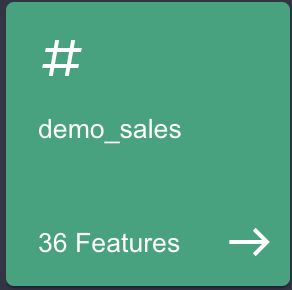
and
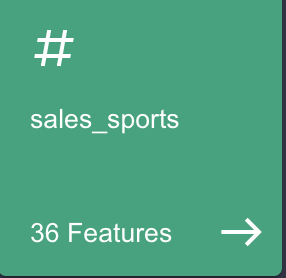

Clicking on either card will take you to the list of all the features with that tag (in this case, all features published in the prior step). Similarly, clicking on the **Sales Demo Data** card next to **Data Sources** will take you to the same list.

This list of features will show a card for each feature. For example,

  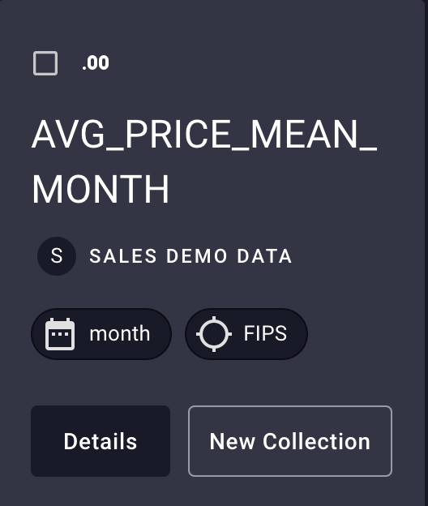

is the feature called AVG_PRICE_MEAN_MONTH, it is a floating point number (the *.00* in the upper left), comes from "Sales Demo Data", has the dimension/granularity of **Month** and **FIPS**. Clicking on the **Details** button

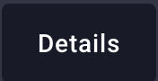

will show you the feature details including basic statistics, a histogram of the distribution, the value over time, and data quality checks. Click the browser back button to go back to the previous page and explore additional features from the list, or click **< Features** in the upper left to go back to the intial **Explore Features** page.

For this analysis, you are trying to predict the sales data, so type "sales" into the search bar.

  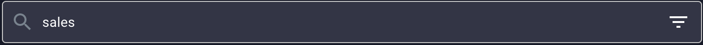

to show the **SALES_SUM_MONTH** card.

  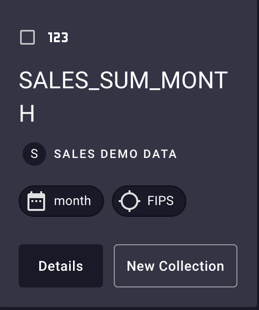

You can click on **Details** to explore the statistics again. 

### 9. Create an intial modeling dataset
Rasgo uses collections &mdash; shown by the button in the upper left &mdash;

to contain all of the features of interest for the final modeling dataset. To create a collection around the **SALES_SUM_MONTH** feature, click the **New Collection** button

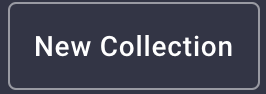

from either the feature card or feature details page. Fill in the **COLLECTION NAME** and (optionally) the **DESCRIPTION** before clicking the **Create Collection** button.

  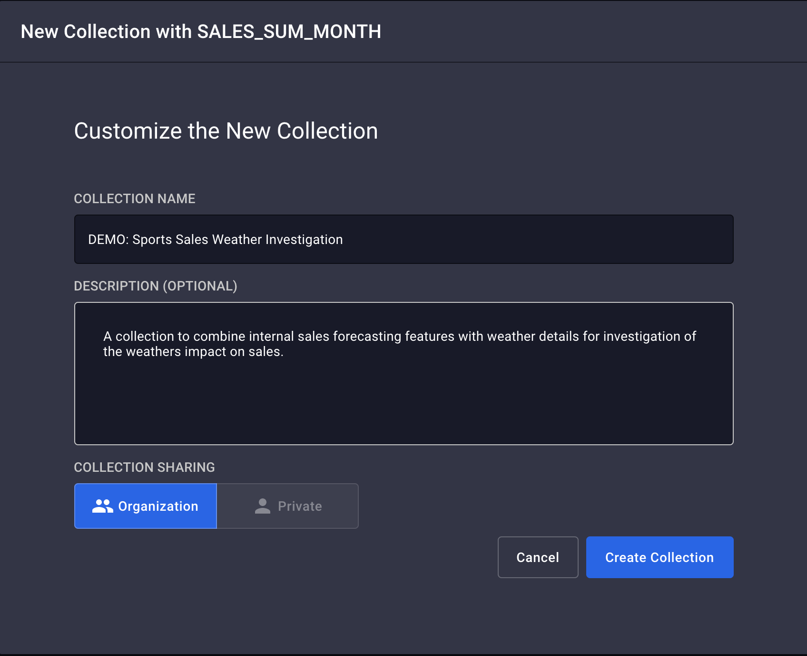

The current collection contains only one feature (**SALES_SUM_MONTHS**). To add the additional features from the same data source, click on the *demo_sales* or *sales_sports* Hashtags 

  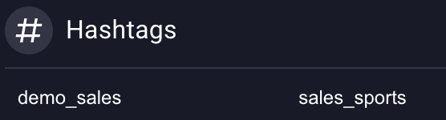

or the *Sales Demo Data* Data Source

  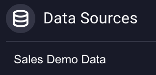

to open a list of the rest of the features from the initial dataset. Clicking **Details** for any feature will show the feature profile and **Add to Collection** will add just this feature to the collection. Since all of this data is necessary for the analysis, Click **SELECT ALL** at the top of the list

  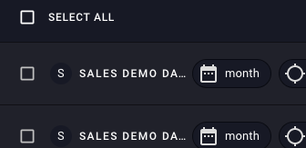

to check all the features in the list and **ADD SELECTED** to the right of the **SELECT ALL** button

  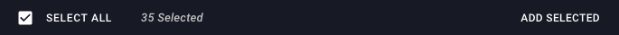

to add all the selected features to the collection. The right hand side of the screen shows that this collection contains one data source (**Sales Demo Data**) and 36 Features.

  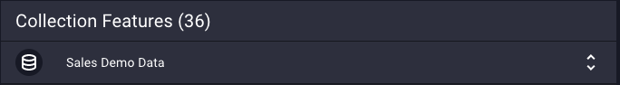

To expand and collapse the list of features in **Sales Demo Data**, click the bar around **Sales Demo Data**.

  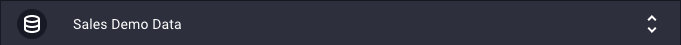

At this point, the collection contains all of the data that was originally uploaded from the monthly sales dataframe.

### 10. Add weather data to the sales data
To add the weekly weather data, we can search for data or select the relevant Hashtag or Data Source. First, in order to see all the feature categories again, click the **Explore Categories** button.

Next, to fet the weekly weather data, select *Dark Sky:Weekly* from Data Sources.

  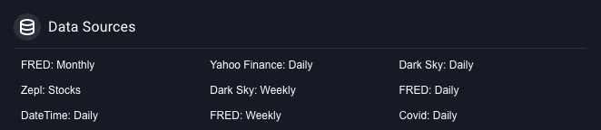

Repeat the process to select all the features and add the selected to the collection. The features don't immediately show up on the list of features in the collection. This is because the initial data is at a monthly level, but the weather data is at a weekly level. To aggregate the weather data to monthly, click on **Transform** above the **Collection Features**.

  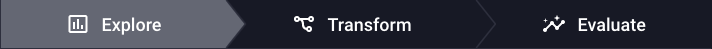

The top of the **Transform** page shows the **DARKSKY:FIPS W...** data source and the features contained within it.

  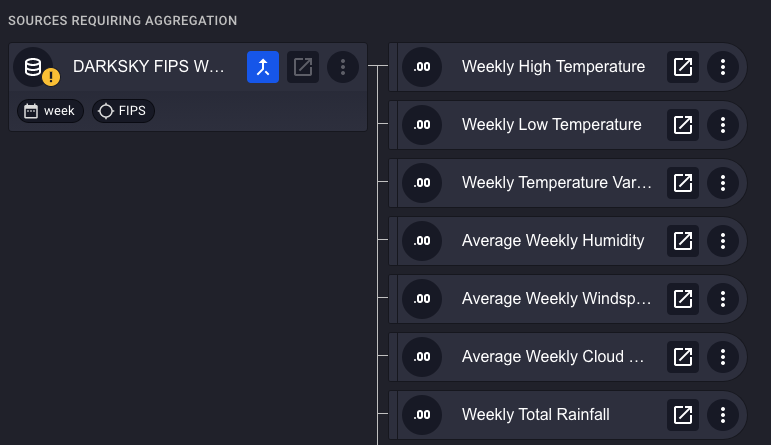

Rasgo indicates that the weather data needs aggregation by showing  **Dark Sky** under the *SOURCES REQUIREING AGGREGATION*.  In addition, the **DARKSKY** card has a caution symbol on it

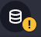

and the button to aggregate the data is highlighted.

Click this button to aggregate the weekly data to monthly. 

For each of the features in the source, select the aggregations to apply. If no aggregations are selected, that feature will not be aggregated and added the collection. 

  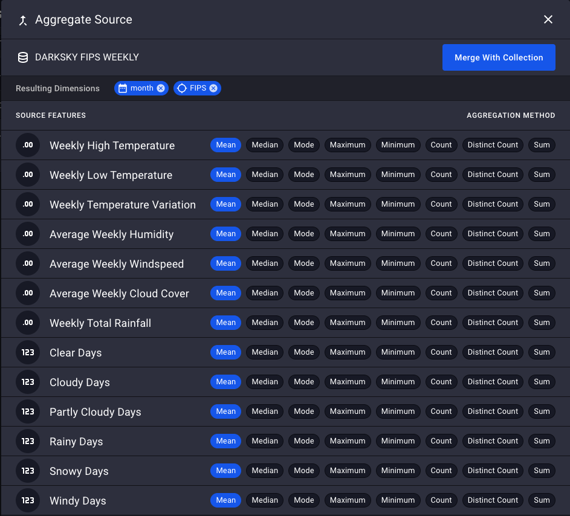

Multiple aggregations for a feature can be selected if desired.

  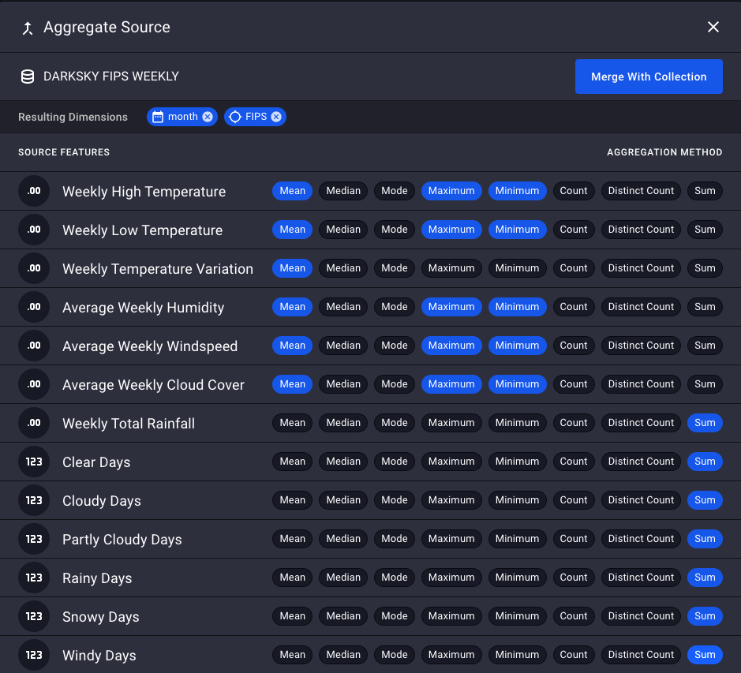

Click **Merge With Collection**

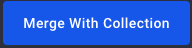

to add the aggregated weather data to the collection. Scrolling down shows these new features.

  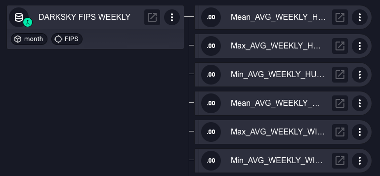

### 11. Lag the weather data
There is one issue with this data. The *Monthly Sales* data summarizes the previous month, but the aggregated weather data is from the current month. In order to see the impact of weather on sales, we need to change the weather data from the current month to the previoous month. This can be done by applying a **lag** function. To do this in Rasgo, click the **Transform** button on the bottom right of the screen.

  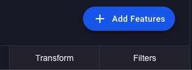

Type "lag" in the search bar

  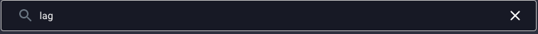

and click on **Lag** in the list below.

  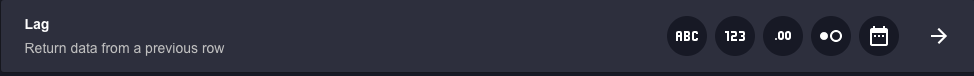

This brings up the window to control the lag. On the left hand side, features can be selected to apply the lag to. On the right hand side, the parameters of the lag can be set.

  

First, set the lag to be one month by typing "1" into the **Value** box on the right hand side.

  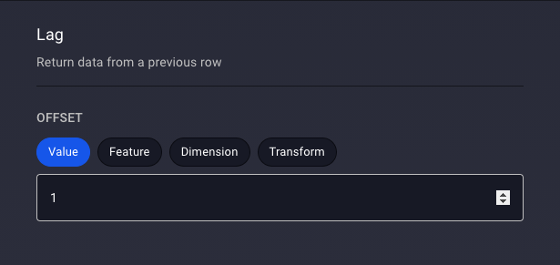

Then select the weather features on the left hand side.

  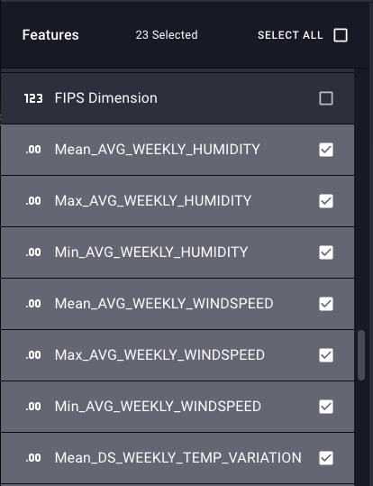

and click the **Apply *N* Transformations** to create these lag variables.

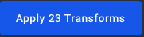

Additional lags and other transformations can be created using a similar process. Once you are done creating lags, the collection is complete and you are ready to pull this combined dataset into your Python environment as a pandas dataframe.

### 12. Download the combined data to pandas
To tell Rasgo that you are finished creating the modeling data set, click the **Refresh Data** button in the upper right corner.

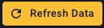

Click either the **Refresh Training Data**

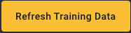

or the **Generate Training Data** buttons.

This causes Rasgo to make all of the data in this collection as a view in Snowflake.  Once this is done, you can easily access the data from Python.

Note your collection id from the URL

    https://app.rasgoml.com/collections/<collection_id>

You can now download this data into pandas by running

    collection_id = <collection_id from URL>
    df = rasgo.read.collection_data(collection_id)

## Summary
In this demo, you have seen how a senior data scientist can leverage Rasgo to share the results of their data preparation and feature engineering process to the rest of their team by:
1. Create an account on Rasgo.
2. Upload the completed dataframe from Python to Rasgo.
3. Publish that data so that others in your organization will be able to find the data.

Once the data has been shared, the rest of the team can easily find and extend this work to reduce duplication of data preparation and feature engineering and ensure consistency of features across all projects by:
1. Log into the Rasgo web app.
2. Find the sales data.
    1. Explore the data
    2. Create an intial modeling dataset.
3. Find and join weather data.
4. Aggregate weekly data and perform feature engineering.
4. Extract the data from Rasgo to pandas for final analysis

