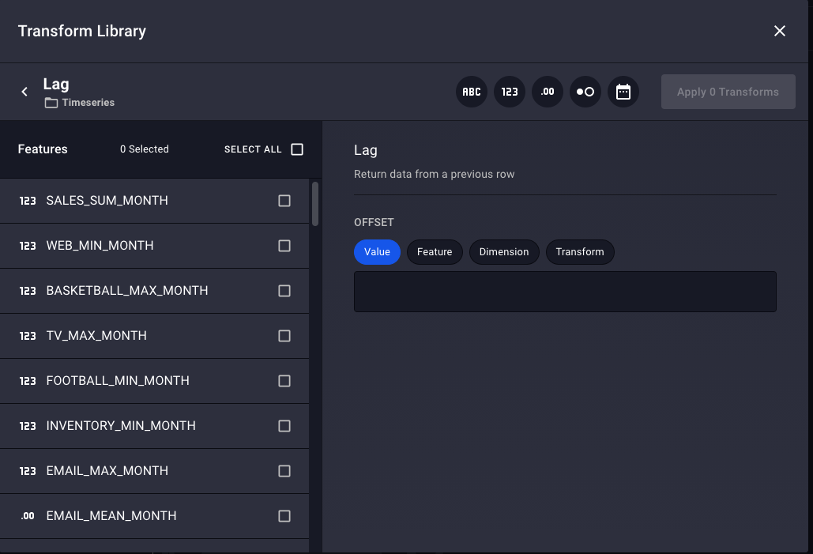
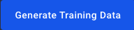

# Rasgo Demonstration
## Demo Use Case
You work for a large sporting good manufacture. As a senior data scientist, you have been asked to prepare the necessary data for modeling. You have been given access to:
- Daily sales
- Weekly advertising spend
- Weekly inventory and pricing
at the store level. In addition, country wide advertising and Google trends data for key sports terms has been provided weekly.

You have finished working with all of this data in Python to create a monthly summary of sales and the key factors that may drive these sales as a Pandas dataframe. You are now ready to share this data so it is available to the rest of the team.

Once this data is shared, a more junior data scientist is asked to examine the impact of weather on sales.

In this demo, working as the senior data scientist, you will:
1. Create an account on Rasgo.
2. Upload the completed dataframe from Python to Rasgo.
3. Publish that data so that others in your organization will be able to find the data.

As the junior data scientist, you will:
1. Log into the Rasgo web app.
2. Find the sales data.
    a. Explore the data
    b. Create an intial modeling dataset.
3. Find and join weather data.
4. Aggregate weekly data and perform feature engineering.
4. Extract the data from Rasgo to Pandas for final analysis

## Demo
This demo assume that you have completed the data preparation process on all internal sales, marketing and inventory data to create a monthly sales dataset ready for use. The data can be found [here]().

### 1. Install PyRasgo.
In order to publish and view data on the Rasgo Web App, you will need to install Rasgo's PyRasgo Python package to interact with the system from Python.

    pip install pyrasgo

### 2. Create account on Rasgo.
Next, click [here](https://app.rasgoml.com/account/register) to create an account on the Rasgo UI. Fill in the required information on the web page.

You can close the browser tab as you will receive an email from rasgo with a button to verify your email address. Click to verify.

This will open browser tab where you can log into the UI.

### 3. Log into the Rasgo UI
Enter your username and password and click **Login**.

to be taken to the Rasgo App homepage.

### 4. Copy your API key
Click the **API KEY*** button

to copy your API key to the clipboard.

### 5. Connect to Rasgo from Python
Using the API Key, create a connection to Rasgo from Python.

    rasgo = pyrasgo.connect("<API Key from clipboard>")
        
### 6. Copy the final modeling dataset into Python
The data can be found [here](). You can download it into a pandas dataframe by running

    url = ""
    modelingdf = pd.read_csv(url)
    
Convert the date representing the month (**MONTH**) into a datetime compatible with Rasgo to enable datetime related feature engineering and merging.

    modelingdf['MONTH'] = pd.to_datetime(modelingdf.MONTH).dt.date
    
### 7. Publish data to Rasgo
First, the dataframe will be published to Rasgo as a source. This will create a table on Snowflake that will store the data.

    datasource = rasgo.publish.source_data(source_type="dataframe",
                                           df=modelingdf,
                                           data_source_name="Sales Demo Data",
                                           data_source_table_name="SALES_DEMO_DATA",
                                           if_exists="replace")
                                           
The key parameters are:
- *data_source_name*: Specify the name of the data source as it will appear on Rasgo.
- *data_source_table_name*: Specify the name of the Snowflake table this data will be stored in.
- *if_exists*: Control what happens when a source is published more than once.
    - "fail": Causes the program to fail.
    - "replace": Replaces the existing data with the data contained in the dataframe.
    - "append": Appends the data in the dataframe to the existing data in the Snowflake table.
                                           
Next, in order to make this data available for others to use within Rasgo, the data needs to be published as features.

    featureset = rasgo.publish.features_from_source(data_source_id=datasource.id,
                                                    dimensions=['MONTH', 'FIPS'],
                                                    granularity=['month', 'FIPS'],
                                                    features=features,
                                                    feature_set_name="Month Sports Sales",
                                                    tags=['demo_sales', 'sales_sports'],
                                                    sandbox=False)

The key parameters are:
- *dimensions*: The columns in the original dataframe or source that can be used to join or merge data together.
- *granularity*: Certain types of columns may represent different levels within the data. For example, a date could represent an hour, a day, a week, a month, etc.
- *feature_set_name*: The name these features can be found under on the UI.
- *tags*: Rasgo allows you to set hashtags on features that can be used to find the features.
- *sandbox*: Rasgo allows you to specify if the features are ready for production (**False**), otherwise (**True**) they are marked as sandbox features.

At this point, the senior data scientist has published the results of their data preparation process. In the next few steps, a junior data scientist will find this data on the Rasgo UI, begin working with it and ultimately pull it back into their Python environment for further analysis.

### 8. Find sales data on Rasgo
When you first open [Rasgo](https://app.rasgoml.com), you are shown the homepage that details recent activity within your organization. You can search for and examine features by clicking the feature button in the upper left hand corner.

to take you to the **Explore Features** page.

You can explore by **Hashtags**, **Data Sources**, **Dimensions**, or **Data Types**. Most commonly you will explore by **Hashtags**

where you can see the hashtags created in the previous step:
 and 

Clicking on either card will take you to the list of all the features with that tag (in this case, all features published in the prior step). Similarly, clicking on the **Sales Demo Data** card next to **Data Sources** will take you to the same list.

This list of features will show a card for each feature. For example,

is the feature called AVG_PRICE_MEAN_MONTH, it is a floating point record (the **.00** in the upper left), comes from "Sales Demo Data", has the dimension/granularity of **Month** and **FIPS**. Clicking on the **Details** button

will show you the feature details including basic statistics, a histogram of the distribution, the value over time, and data quality checks. Click the browser back button to go back to the previous page and explore additional features from the list, or click **< Features** in the upper left to go back to the intial **Explore Features** page.

For this analysis, you are really interested in the sales data, so type "sales" into the search bar.

to show the **SALES_SUM_MONTH** card.

You can click on it to explore the statistics again. 

### 9. Create an intial modeling dataset
Rasgo uses collections -- shown by the button in the upper left --

to contain all of the features of interest for the final modeling dataset. To create a collection around the **SALES_SUM_MONTH** feature, click the **New Collection** button

from either the feature card or feature details page. Fill in the **COLLECTION NAME** and (optionally) the **DESCRIPTION** before clicking the **Create Collection** button.

The current collection contains only one feature (**SALES_SUM_MONTHS**). To add the additional features from the same data source, click on the *demo_sales* or *sales_sports* Hashtags 

or the *Sales Demo Data* Data Source

to open a list of the rest of the features from the initial dataset. Clicking **Details** for any feature will show the feature profile and **Add to Collection** will add just this feature to the collection. Since all of this data is necessary for the analysis, Click **SELECT ALL** at the top of the list

to check all the features in the list and **ADD SELECTED** to the right of the **SELECT ALL** button

to add all the selected features to the collection. The right hand side of the screen shows that this collection contains one data source (**Sales Demo Data**) and 36 Features.

To expand and collapse the list of features in **Sales Demo Data**, click the bar on the right hand side.

To show the feature categories on the right hand side, click the **Explore Categories** button.

At this point, the collection contains all of the data that was originally uploaded from the monthly sales dataframe.

### 10. Add weather data to the sales data
To add the weekly weather data, we can search for data or select the relevant Hashtag or Data Source. In this case, select *Dark Sky:Weekly* from Data Sources.

Repeat the process to select all the features and add the selected to the collection. The features don't immediately show up on the list of features in the collection. This is because the initial data is at a monthly level, but the weather data was at a weekly level. To aggregate the weather data to monthly, click on **Transform** above the Collection Features.

The top of the **Transform** page shows the **DARKSKY:FIPS W...** data source and the features contained within it.

This source requires aggregation as it is weekly, but the collection is monthly data. You can see this because **Dark Sky** is under the *SOURCES REQUIREING AGGREGATION*, the **DARKSKY** card has a caution symbol on it

and the button to aggregate the data is highlighted

Click this button to aggregate the weekly data to monthly. 

For each of the features in the source, select the aggregations to apply to each feature. If no aggregations are selected, that feature will not be in the collection. Multiple aggregations for a feature can be selected if desired.

Click **Merge With Collection**

to add the aggregated weather data to the collection. Scrolling down shows these new features.

### 11. Lag the weather data
There is one problem with the data. The Monthly Sales data summarizes the previous month, but the aggregated weather data is the data from that month. In order to see the impact of weather on sales, we need to change the weather data from the current month to the previoous month. This can be done by applying a **lag** function. To do this in Rasgo, click the **Transform** button on the bottom right of the screen.

Type "lag" in the search bar

and click on **Lag** in the list below.

This brings up the window to control the lag. On the left hand side, features can be selected to apply the lag to. On the right hand side, the parameters of the lag can be set.

First, set the lag to be one month by typing in "1" into the **Value** box on the right hand side.

Then select the weather features on the left hand side.

and click the **Apply *Number* Transformations** to create these lag variables.

Additional lags and other transformations can be created using a similar process. Once you are done creating lags, the collection is complete and you are ready to pull this combined dataset into your Python environment as a Pandas dataframe.

### 12. Download the combined data to Pandas
To tell Rasgo that you are finished creating the modeling data set, click the **Refresh Data** button in the upper right corner.

Click either the **Refresh Training Data**

or the **Generate Training Data** buttons.

Note your collection id from the URL

    https://app.rasgoml.com/collections/<collection_id>

You can then download this data into Pandas by running

    collection_id = <collection_id from URL>
    df = rasgo.read.collection_data(collection_id)

